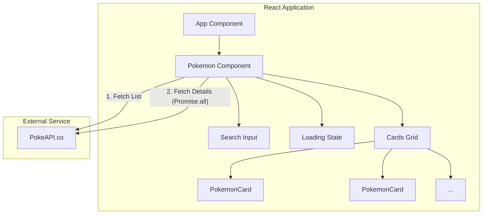

<div align="center">
  <h1>✦ Catch Pokémon — React Web App ✦</h1>
  <p align="center" >
  
</p>

  <p>
    <em>A beautiful and responsive Pokémon explorer application built with React, Vite, and the PokeAPI.</em>
  </p>

  <a href="https://catchpokemon-byjay.vercel.app" target="_blank">
    
  </a>

  <br />
  <br />

  <div>
    
    
    
    
  </div>
</div>

---

## 📋 Table of Contents

- [🚀 What is Catch Pokémon?](#-what-is-catch-pokémon)
- [✨ Features](#-features)
- [🛠️ Tech Stack](#️-tech-stack)
- [🏗️ Architecture](#-architecture)
- [🚀 Getting Started](#-getting-started)
- [📁 Project Structure](#-project-structure)
- [🤝 Contributing](#-contributing)
- [📜 License](#-license)

---

## 🚀 What is Catch Pokémon?

**Catch Pokémon** is a fast, responsive, and beautifully designed web application that allows users to explore and search for their favorite Pokémon. Fetching real-time data from the open-source **PokeAPI**, the app displays detailed statistics for each Pokémon, including their type, height, weight, speed, base experience, attack stats, and primary abilities.

---

## ✨ Features

- 🔍 **Real-time Search** — Instantly filter through the list of Pokémon by typing their name.
- 🃏 **Detailed Pokémon Cards** — Each card displays comprehensive data including dream-world sprites, stats, and types.
- ⚡ **Blazing Fast** — Built with Vite for instant HMR and optimized production builds.
- 🔄 **Async Data Fetching** — Efficiently handles multiple parallel API requests to gather detailed statistics.
- 🎨 **Responsive Design** — Fully styled with pure CSS to ensure it looks great on all devices.

---

## 🛠️ Tech Stack

| Technology | Purpose |
|------------|---------|
| **React 19** | Component-based UI library for building the interface. |
| **Vite** | Next-generation frontend tooling for lightning-fast development. |
| **PokeAPI** | RESTful API providing comprehensive Pokémon data. |
| **Vanilla CSS** | Custom styling and responsive grid layouts. |

---

## 🏗️ Architecture



---

## 🚀 Getting Started

### Prerequisites
- **Node.js** (v18.x or higher recommended)

### 1️⃣ Clone the Repository
```bash
git clone https://github.com/jaypatel-tech116/Catch_Pokemon.git
cd catchpokemon-byjay
```

### 2️⃣ Install Dependencies
```bash
npm install
# or
bun install
```

### 3️⃣ Start Development Server
```bash
npm run dev
# or
bun run dev
```

Navigate to **http://localhost:5173** in your browser to start exploring!

---

## 📁 Project Structure

<details>
<summary><b>Click to expand folder structure</b></summary>

```text
Pokemon_React/
├── public/                  # Static assets
├── src/
│   ├── assets/              # Images and icons
│   ├── App.jsx              # Root component
│   ├── App.css              # App specific styles
│   ├── index.css            # Global styles and CSS variables
│   ├── main.jsx             # React rendering entry point
│   ├── Loading.jsx          # Loading spinner/state component
│   ├── Pokemon.jsx          # Main container and API logic
│   └── PokemonCards.jsx     # UI component for individual Pokémon
├── index.html               # Main HTML file
├── package.json             # Project metadata and dependencies
└── vite.config.js           # Vite configuration
```
</details>

---

## 🤝 Contributing

Contributions, issues, and feature requests are welcome! 

1. **Fork** the project repository.
2. **Create** your feature branch: `git checkout -b feature/AmazingFeature`
3. **Commit** your changes: `git commit -m "feat: Add some AmazingFeature"`
4. **Push** to the branch: `git push origin feature/AmazingFeature`
5. **Open** a Pull Request.

---

## 📜 License

This project is open-source and available under the [MIT License](LICENSE).

---

## 🌟 Show Your Support

If you liked this project, please consider giving it a ⭐ star!

<div align="center">
  <strong>Built with 💛 by <a href="https://github.com/jaypatel-tech116">Jay Patel</a></strong>
</div>
